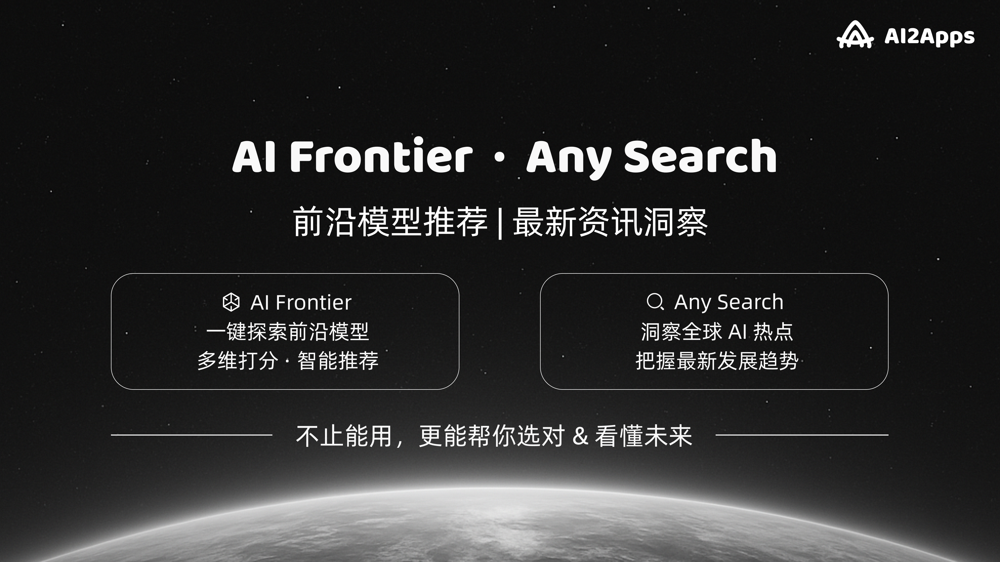
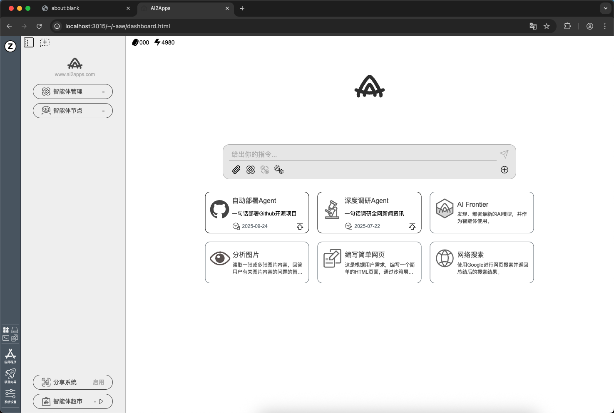
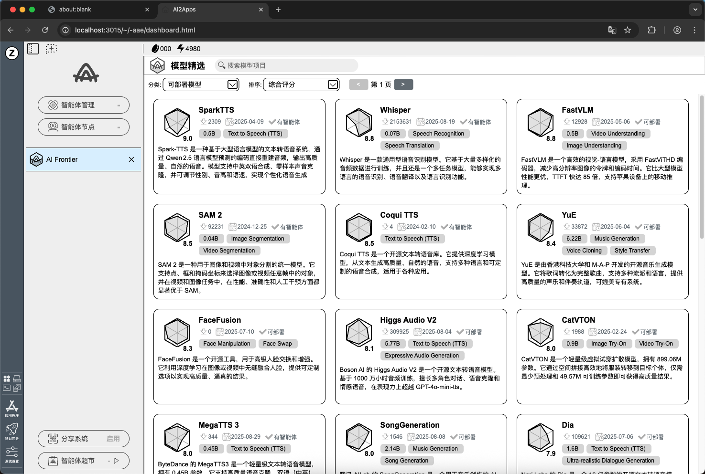
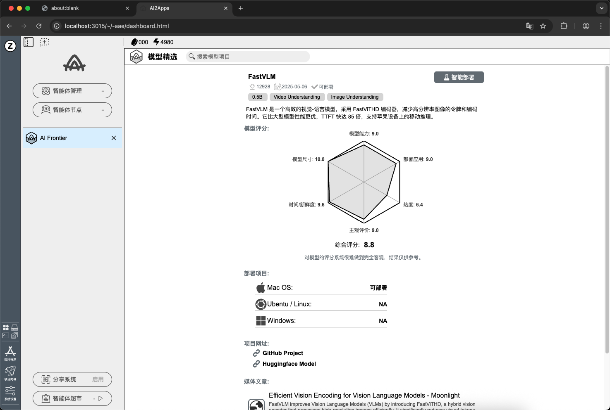

<div align="center">

  <a name="readme-top"></a>

  
  <p style="font-size:24px !important;">本地优先的通用 AI 智能体平台</p>
  <h1></h1>
  <p>让 AI 回到你的电脑中，成为属于你的智能伙伴。</p>
  <p>AI2Apps 是一个`本地优先`的通用 AI 智能体平台，连接从信息感知、模型部署到创作生产的完整链路，让每个人都能在个人电脑上运行、控制并创造属于自己的 AI 能力。</p>
  [](https://www.xiaohongshu.com/user/profile/5fdeafe6000000000100a1f3)

</div>

## 📦 项目简介

> AI2Apps 是一个**本地优先的智能体应用平台**，聚合**多信源资讯引擎（AnySearch）**与**前沿模型尝鲜平台（AI Frontier）**。
> 它既能帮助用户快速获取和再生产个性化资讯，又能一键体验最新的多模态 AI 模型，探索跨模态的创新玩法。
> 通过**本地智能体引擎**，AI2Apps 实现了低成本、隐私安全的计算与分发，致力于成为 **个人 AI PC** 的应用入口。

<div align="center">
  
</div>

## ✨ 功能亮点

- **[一键部署](https://youtu.be/rSkvvDIjH4M)**：AI 自动帮助用户在本地环境部署最新模型，无需繁琐配置。

- **多模态接入**：支持文本、语音、图像、视频等模型，自由组合。

- **多信源聚合**：实时获取谷歌、百度、小红书、X、领英、维基百科、知乎等信源，结合 LLM 自动总结与趋势提炼。

- **应用驱动**：从资讯到模型，从检索到生成，形成可分享的智能体玩法。

## 💡 应用玩法

🔎 **资讯相关**

- **热点快报**：输入关键词 ➡️ AnySearch 聚合多信源 ➡️ LLM 总结为 *每日简报*。

- **趋势追踪**：自动抓取单个赛道的资讯流，如 `AI 芯片`，形成 *趋势演进报告*。

- **投资/研究助手**：结合多信源 ➕ 本地模型，生成个性化 *研究笔记*。

🎨 **模型相关**

- **[音乐心情](https://youtu.be/bYN78KXqvHo)**：输入心情 ➡️ 模型生成歌词 ➕ 配乐 ➡️ 一键播放。

- **视频配音**：上传视频 ➡️ AI 生成多语言配音/搞笑配音。

- **图文生成**：输入主题 ➡️ AI 生成封面插画/漫画故事。

🧩 **综合玩法**

- **[快速研究报告](https://youtube.com/shorts/65RfFDAZUas?feature=share)**：AnySearch 抓取多信源 ➡️ AI Frontier 模型生成摘要 ➡️ 输出成 PDF 报告。

- **互动创作**：基于资讯或热点，用户 ➕ AI 共同完成故事接龙/短剧本。

- **个性化资讯包**：资讯 ➕ 模型处理 ➡️ 生成多模态资讯包（文字+图+音频），可分享/社交。

## 🚀 快速开始

### 本地部署

1. 安装 [Anaconda](https://www.anaconda.com/) 

2. 下载 [AI2Apps Demo](https://github.com/Avdpro/ai2apps)

```bash
git clone https://github.com/Avdpro/ai2apps.git
```

3. 修改.env文件，配置正确的OpenAI Key以及服务端口，默认的端口是3015。

```
APIROOT=https://www.ai2apps.com/ws/
OPENAI_API_KEY=sk-XXXXXXXXXXXXXXXXXXXXXXXXXXXXXXXXXXXXXXXXXXXXXXXX
PORT=3015

# 注释解除
AAF_EXECUATABLE=/Applications/Google Chrome.app/Contents/MacOS/Google Chrome
```

4. 安装依赖

```bash
cd ai2apps
npm install
```

```bash
cd agents
pip install -r requirements.txt
```

5. 启动项目

```bash
cd ai2apps
node ./start.js
```
> 当 ai2apps 项目启动成功后，浏览器将自动打开 dashboard 页面。
> 如果您是第一次访问，请先注册一个新账号，按照提示填写必要的信息以创建您的账号。
> 注册完成后，使用您刚刚创建的账号信息进行登录。
> 登录成功后，您将能够访问并使用 dashboard 页面。

<p>
  
</p>

### 体验 AI Frontier

1. 点击 dashboard 页面中间区域 `AI Frontier` 卡片，即可进入模型展示页，如下图所示。

<p>
  
</p>

2. 在模型列表页面，您可以自由选择任一模型以查看其详细信息（如下载量、模型大小、模型类别、模型介绍、模型评分等），并实现快速部署与模型体验。以 FastVLM 模型为例，操作步骤如下：

- 点击 `FastVLM` 卡片，进入该模型的详情页。

- 点击右上角 `智能部署` 按钮，将立即启动模型部署流程。

<p>
  
</p>

> 为了帮助您更直观地了解整个部署过程，我们提供了详细的视频教程，您可以通过以下链接查看：[视频教程](https://github.com/zdq93/zdq93.github.io)。

## 📝 引用

如果您觉得我们的工作对您的研究或应用有帮助，请引用我们的论文： 

1. [AI2Apps](https://arxiv.org/abs/2404.04902?context=cs.SE)
```
@article{pang2024ai2apps,
  title={AI2Apps: A Visual IDE for Building LLM-based AI Agent Applications},
  author={Pang, Xin and Li, Zhucong and Chen, Jiaxiang and Cheng, Yuan and Xu, Yinghui and Qi, Yuan},
  journal={arXiv preprint arXiv:2404.04902},
  year={2024}
}
```

2. [AI2Agent](https://arxiv.org/abs/2503.23948)
```
@article{chen2025ai2agent,
  title={AI2Agent: An End-to-End Framework for Deploying AI Projects as Autonomous Agents},
  author={Chen, Jiaxiang and Shi, Jingwei and Gan, Lei and Zhang, Jiale and Zhang, Qingyu and Zhang, Dongqian and Pang, Xin and Li, Zhucong and Xu, Yinghui},
  journal={arXiv preprint arXiv:2503.23948},
  year={2025}
}
```

3. [Slimrag](https://arxiv.org/abs/2506.17288)
```
@article{zhang2025slimrag,
      title={SlimRAG: Retrieval without Graphs via Entity-Aware Context Selection}, 
      author={Jiale Zhang and Jiaxiang Chen and Zhucong Li and Jie Ding and Kui Zhao and Zenglin Xu and Xin Pang and Yinghui Xu},
      journal={arXiv preprint arXiv:2506.17288},
      year={2025}
}
```

## 📜 License

本项目将以开源协议发布，具体 License 将在正式版中更新。

<p align="right" >
  <a href="#readme-top">
    ↑ 返回顶部 ↑
  </a>
</p>


