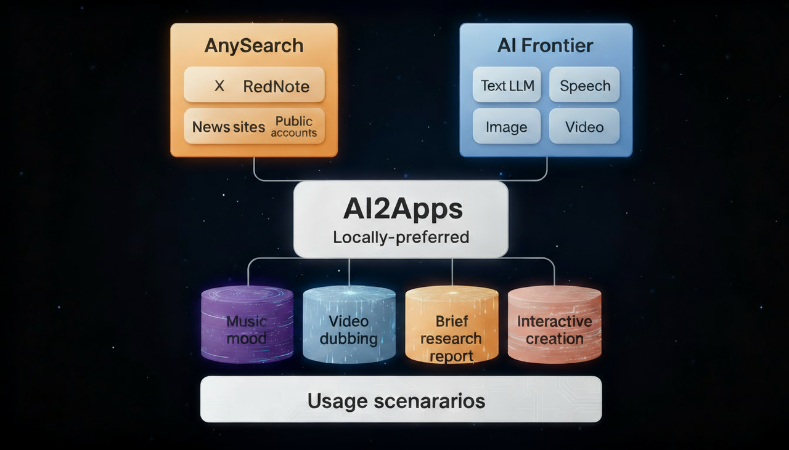

<div align="center">

  <a name="readme-top"></a>

  <h1>AI2Apps</h1>

  <p>本地优先的通用 AI 智能体平台</p>
  
  <p style="font-weight:600 !important">让 AI 回到你的电脑中，成为属于你的智能伙伴。</p>

  <p>AI2Apps 是一个 <strong>本地优先</strong> 的通用 AI 智能体平台，连接从信息感知、模型部署到创作生产的完整链路，让每个人都能在个人电脑上运行、控制并创造属于自己的 AI 能力。</p>

  [English](./README.md) · 中文

  [](https://www.xiaohongshu.com/user/profile/5fdeafe6000000000100a1f3)

</div>

<!-- <div align="center">
  
</div> -->

## 🌍 平台概述

**AI2Apps** 重新定义了人与 AI 的交互方式。我们将计算范式从**依赖云端**转向**自主本地**，让 AI 不再只是工具，而是成为**个人的智能操作系统**。<br>

> 平台由三大核心模块构成，共同形成从`信息` ➡️ `模型` ➡️ `创作`的闭环生态：

| **模块名称**   | **功能简介**                                                                 |
|:---------------|:-----------------------------------------------------------------------------|
| 🔍 AnySearch   | 多信源智能引擎，整合 X、小红书、新闻等实时信源，支持语义聚合与摘要生成。       |
| ⚙️ AI Frontier  | 前沿模型探索与一键部署中心，自动发现、评测、运行最新 AI 模型。                 |
| 🎨 AI Studio    | 多模态创作工坊，连接文本、图像、音视频模型，实现创意生产与生态协作。           |  |

> 所有模块均运行在自研的**AI2Agent Core 框架**之上，实现多智能体调度、本地推理、安全隔离与记忆管理。


## ✨ 核心功能亮点

- 🧠 **本地优先**：所有推理与生成均在本地运行，数据安全、隐私可控。  

- ⚙️ [一键部署](https://youtu.be/rSkvvDIjH4M)：自动发现并本地化部署开源模型，零配置即可使用。  

- 🔍 **多信源检索**：跨平台抓取高价值内容，智能聚合、关联分析与摘要。  

- 🎨 **多模态创作**：同一界面中无缝调用文本、语音、图像与视频模型。  

- 🧩 **模块化扩展**：支持插件、Agent 商店与个性化 AI 应用生态。


## 📈 系统演进路径

从`信息聚合` ➡️ `模型部署` ➡️ `创意生产`，**AI2Apps 的能力持续进化，构建完整的本地智能体生态闭环**。


## 💡 应用场景与玩法

| **场景**       | **描述**                                                                 |
|:---------------|:-------------------------------------------------------------------------|
| 🧠 研究与分析   | 使用 AnySearch 收集多源信息，结合 Frontier 模型进行本地数据分析与推理。       |
| ⚙️ 模型尝鲜     | 自动发现并部署最新 AI 模型，进行一键评测与效果对比。                         |
| 🎬 创意生产     | 借助 AI Studio 快速生成营销视频、概念图、播客或品牌文案。                     |
| 🎵 AI 玩法     | [音乐心情](https://youtu.be/bYN78KXqvHo)、AI 配音、故事接龙、互动剧本杀等多模态玩法。                     |
| 🔐 私域智能体   | 在离线环境中构建专属情报或知识智能体，数据完全本地存储。                     |


## 🌟 愿景

> **从信息到创造，从云端回归个人**。<br>
> AI2Apps 让每一台电脑都成为你的智能体引擎，让每个人都能自由掌控 AI，创造属于自己的智能世界。


## 🧭 项目规划

| 阶段 | 目标 | 状态 |
|------|------|------|
| 阶段 1 | 核心框架<br>AI2Agent 本地智能体运行框架 | ✅ 已完成 |
| 阶段 2 | AnySearch<br>多信源聚合引擎 | ✅ 初步完成 |
| 阶段 3 | AI Frontier<br>模型探索与本地部署中心 | ✅ 已完成 |
| 阶段 4 | AI Studio<br>多模态创作与生态工作台 | 🧪 原型阶段 |
| 阶段 5 | Playkits<br>玩法生态<br>用户共创与社区玩法 | 🕛 规划中 |


## ⚙️ 安装与运行

### 本地部署

1. 安装 [Anaconda](https://www.anaconda.com/) 

2. 下载 [AI2Apps Demo](https://github.com/Avdpro/ai2apps)

```bash
git clone https://github.com/Avdpro/ai2apps.git
```

3. 修改.env文件，配置正确的OpenAI Key以及服务端口，默认的端口是3015。

```
APIROOT=https://www.ai2apps.com/ws/
OPENAI_API_KEY=sk-XXXXXXXXXXXXXXXXXXXXXXXXXXXXXXXXXXXXXXXXXXXXXXXX
PORT=3015

# 注释解除
AAF_EXECUATABLE=/Applications/Google Chrome.app/Contents/MacOS/Google Chrome
```

4. 安装依赖

```bash
cd ai2apps
npm install
```

```bash
cd agents
pip install -r requirements.txt
```

5. 启动项目

```bash
cd ai2apps
node ./start.js
```
> 当 ai2apps 项目启动成功后，浏览器将自动打开 dashboard 页面。<br/>
> 如果您是第一次访问，请先注册一个新账号，按照提示填写必要的信息以创建您的账号。<br/>
> 注册完成后，使用您刚刚创建的账号信息进行登录。<br/>
> 登录成功后，您将能够访问并使用 dashboard 页面。

<p>
  
</p>

### 🚀 体验 AI Frontier

1. 点击 dashboard 页面中间区域 `AI Frontier` 卡片，即可进入模型展示页，如下图所示。

<p>
  
</p>

2. 在模型列表页面，您可以自由选择任一模型以查看其详细信息（如下载量、模型大小、模型类别、模型介绍、模型评分等），并实现快速部署与模型体验。以 FastVLM 模型为例，操作步骤如下：

- 点击 `FastVLM` 卡片，进入该模型的详情页。

- 点击右上角 `智能部署` 按钮，将立即启动模型部署流程。

<p>
  
</p>

> 为了帮助您更直观地了解整个部署过程，我们提供了详细的视频教程，您可以通过以下链接查看：[视频教程](https://github.com/zdq93/zdq93.github.io)。


## 📝 引用

如果您觉得我们的工作对您的研究或应用有帮助，请引用我们的论文： 

1. [AI2Apps](https://arxiv.org/abs/2404.04902?context=cs.SE)
```
@article{pang2024ai2apps,
  title={AI2Apps: A Visual IDE for Building LLM-based AI Agent Applications},
  author={Pang, Xin and Li, Zhucong and Chen, Jiaxiang and Cheng, Yuan and Xu, Yinghui and Qi, Yuan},
  journal={arXiv preprint arXiv:2404.04902},
  year={2024}
}
```

2. [AI2Agent](https://arxiv.org/abs/2503.23948)
```
@article{chen2025ai2agent,
  title={AI2Agent: An End-to-End Framework for Deploying AI Projects as Autonomous Agents},
  author={Chen, Jiaxiang and Shi, Jingwei and Gan, Lei and Zhang, Jiale and Zhang, Qingyu and Zhang, Dongqian and Pang, Xin and Li, Zhucong and Xu, Yinghui},
  journal={arXiv preprint arXiv:2503.23948},
  year={2025}
}
```

3. [Slimrag](https://arxiv.org/abs/2506.17288)
```
@article{zhang2025slimrag,
      title={SlimRAG: Retrieval without Graphs via Entity-Aware Context Selection}, 
      author={Jiale Zhang and Jiaxiang Chen and Zhucong Li and Jie Ding and Kui Zhao and Zenglin Xu and Xin Pang and Yinghui Xu},
      journal={arXiv preprint arXiv:2506.17288},
      year={2025}
}
```


## 📜 License

本项目将以开源协议发布，具体 License 将在正式版中更新。

<div align="center">
  
</div>


<p align="right" >
  <a href="#readme-top">
    ↑ 返回顶部 ↑
  </a>
</p>


